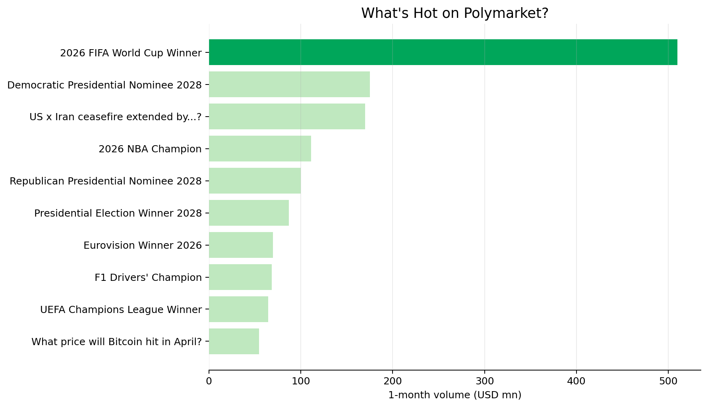
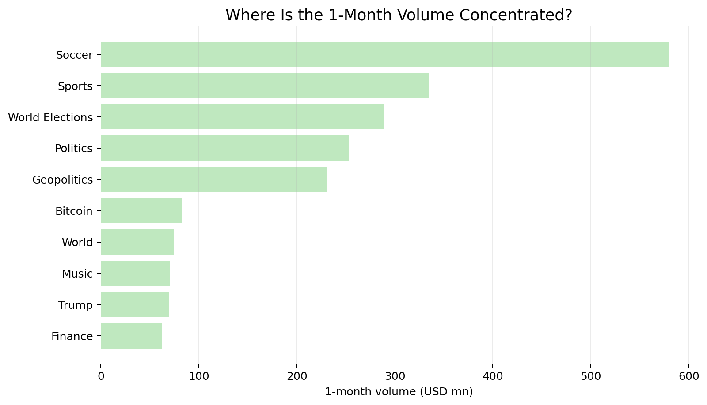
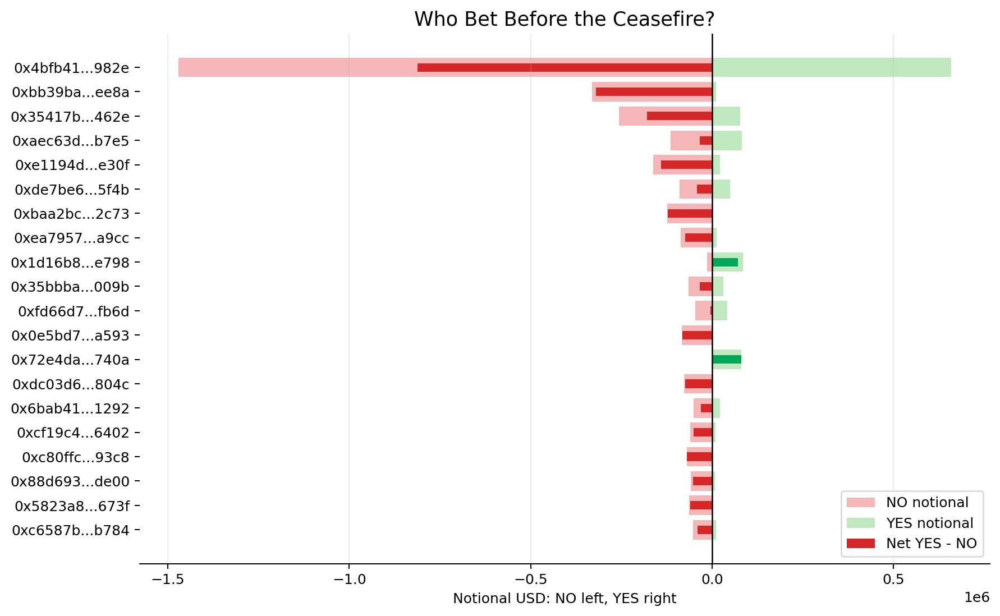

# Polymarket Prediction Market Analysis

This project analyzes open Polymarket activity and then zooms into a US-Iran ceasefire case study to look for abnormal, insider-like wallet behavior before a public news anchor.

The notebook combines:

- Polymarket Gamma API for open event metadata
- Dune API for on-chain Polymarket trading data
- Vertex AI, Claude, and Azure OpenAI for a small LLM decision-support test



## Project Files

| File | Purpose |
|---|---|
| `polymarket_api_analysis.ipynb` | Main notebook with data retrieval, analysis, charts, and conclusions |
| `polymarket_outputs/` | CSV outputs created during the analysis |
| `readme_assets/` | Static chart images used in this README |
| `polymarket_project_flow_v6.svg` | Project workflow diagram |

## Part A: General Polymarket Activity

The first part of the project asks what is currently active on Polymarket. The main event-level metric used here is 1-month traded volume.

### Top Open Events



**Top 5 open events by 1-month volume:**

|     id | title                                | category        |   volume1mo_mn |
|-------:|:-------------------------------------|:----------------|---------------:|
|  30615 | 2026 FIFA World Cup Winner           | Soccer          |         510.03 |
|  30829 | Democratic Presidential Nominee 2028 | World Elections |         175.05 |
| 357625 | US x Iran ceasefire extended by...?  | Geopolitics     |         169.84 |
|  27830 | 2026 NBA Champion                    | Sports          |         111.07 |
|  31875 | Republican Presidential Nominee 2028 | Politics        |          99.79 |

### Volume by Category



**Top categories by 1-month volume:**

| category        |   volume1mo_mn |
|:----------------|---------------:|
| Soccer          |         579.21 |
| Sports          |         334.85 |
| World Elections |         289.27 |
| Politics        |         253.09 |
| Geopolitics     |         230.3  |
| Bitcoin         |          82.72 |
| World           |          74.13 |
| Music           |          70.89 |
| Trump           |          69.33 |
| Finance         |          62.53 |

### LLM Agent Test

The notebook also tests whether LLM agents can help with prediction-market reasoning. For the 2026 FIFA World Cup Winner market, Gemini, Claude, and GPT all produced the same pick, France, but with low confidence. The conclusion is that LLMs are more useful as decision-support tools than as autonomous trading agents.

## Part B: US-Iran Ceasefire Case Study

Prediction markets have been under fire around allegations of insider trading, with extensive news coverage on this issue. The case study uses the US-Iran ceasefire event to ask whether pre-announcement trading data can flag suspicious wallet behavior.

The analysis focuses on the event:

> **US x Iran ceasefire by...?**

The anchor timestamp used in the notebook is **2026-04-07 22:32:00 UTC**. The pre-window is the five hours before that timestamp.

### Pre-Announcement Trading Summary

| Metric | Value |
|---|---:|
| Pre-window trade rows | 2,251 |
| Wallets in pre-window | 632 |
| Total wallet-level notional | $8.44M |
| Top wallet share of notional | 25.24% |
| Top 10 wallet share of notional | 44.34% |
| NO-biased wallets | 510 |
| YES-biased wallets | 122 |

### Wallet Bias Chart

This chart compares each wallet's YES and NO notional in the pre-window. NO notional is shown to the left, YES notional to the right, and the bright overlay shows the net YES-minus-NO position.



**Top wallets by pre-window notional:**

| wallet          |   total_notional_usd |   yes_notional_usd |   no_notional_usd |   net_yes_minus_no_notional | direction_bias    |
|:----------------|---------------------:|-------------------:|------------------:|----------------------------:|:------------------|
| 0x4bfb41...982e |            2,130,165 |            659,003 |         1,471,162 |                    -812,159 | NO (no ceasefire) |
| 0xbb39ba...ee8a |              341,887 |             10,985 |           330,901 |                    -319,916 | NO (no ceasefire) |
| 0x35417b...462e |              334,432 |             77,227 |           257,205 |                    -179,977 | NO (no ceasefire) |
| 0xaec63d...b7e5 |              196,305 |             81,459 |           114,846 |                     -33,387 | NO (no ceasefire) |
| 0xe1194d...e30f |              183,437 |             21,045 |           162,392 |                    -141,347 | NO (no ceasefire) |

### Target Wallet Metadata

The notebook then checks two wallets of interest and compares their creation, funding, and last trade time.

| created_time              | first_funded_time         | last_trade_time           | owner           | polymarket_wallet   | wallet_type   |
|:--------------------------|:--------------------------|:--------------------------|:----------------|:--------------------|:--------------|
| 2025-12-10 15:15:56+00:00 | 2025-12-10 15:16:46+00:00 | 2026-04-24 20:01:04+00:00 | 0xa3c274...f493 | 0x72e4da...740a     | safe          |
| 2026-04-07 13:54:47+00:00 | 2026-04-07 13:59:17+00:00 | 2026-04-07 23:13:43+00:00 | 0x7b6b6b...f286 | 0x68558d...655a     | safe          |

A notable wallet is `0x68558d...655a`. It was created and funded on **2026-04-07**, the same day as the announcement, and its last trade was at **2026-04-07 23:13:43 UTC**. This is an insider-like signal, but it is not proof of insider trading.

## Main Findings

- Polymarket activity is concentrated in a small number of high-attention events and categories.
- The open-event API is useful for platform-level scanning, but deeper wallet analysis requires blockchain-level data from Dune.
- Dune is asynchronous: the notebook submits SQL, polls until the query is complete, and then fetches results.
- In the ceasefire case, the data flags suspicious wallet patterns, especially newly funded wallets with concentrated directional trading.
- On-chain data can show timing, trade size, and directional bias, but it cannot reveal the real-world identity or intent behind a wallet.

## Further Work

- Run the abnormal-trading framework across many events to build a stronger baseline.
- Add realized PnL and price movement around key timestamps.
- Track flagged wallets over time.
- Turn the notebook into a more systematic monitoring tool for unusual prediction-market activity.

## Reproducibility Notes

The notebook expects API credentials in `.env` for Dune and the AI APIs. The `.env` file is intentionally not documented here because it contains private keys.

To reproduce the project, run:

```bash
jupyter notebook polymarket_api_analysis.ipynb
```

The main intermediate CSVs are stored in `polymarket_outputs/`.
